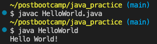
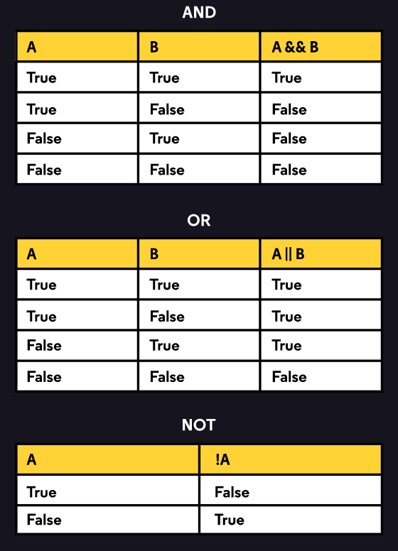

# Java Practice
A place to staret learning Java basics

## Beginner Notes

* ___Sun Microsystems released Java in 1995.___ Slogan was "write once, run everywhere" due to the Java Virtual Machine which ensures the same Java code can be run on different operating systems.
* Java files have ___.java___ extenison.
* ```public static void main(String[] args) {}``` is the common signature for the ```main()``` method. The main method executes the task of the class.
* ```System``` is a built-in Java class that contains useful tools for our programs
* ```out``` is short for output
* ```println``` is short for print line, curcor moves to next line
* ```print``` leaves the cursor on the same line
* ```//``` for single line comment
* ```/* (comment) */``` for multi-line comment
* ```/**  */``` for Javadoc comments. Used to create documentation for APIs. Commonly written before the declaration of fields, methods, and classes
* ___Java is a class based language.___ Classes have a ```main``` method. Class names much match file names. File and class names are ___Pascal cased.___ Methods are ___camel cased.___
* ___Java is a compiled programming language and is case sensitive.___
* ```javac``` terminal command to compile ```.java``` file, include file extension. Produces a ```.class``` file if successful.
* ```java``` to run executable ```.class``` file, do not include file extension when running. Ex:


### Code Example: HelloWorld
```
public class HelloWorld {
  public static void main(String[] args) {
    System.out.println("Hello World!");
  }
}
```
## Variables

* Eight primitive data types: int, double, boolean, char (surrounded by single quotes), byte, long, short, float. Also null, but we know about that.
* ___Literal___ - when code is used to to represent a fixed value.
* Strings are objects, not primitives. There are two ways to to create a ```String``` object:
  * using a ```String``` literal
    * ```String greeting = "Hello World!";```
  * calling the ```String``` class to create a new ```String``` object
    * ```String salutations = new String("Hello World!");```
* Escape characters:
  * ```\"``` allows you to use ```"``` in a string value
    * prints ```"Hello World"``` instead of ```Hello World!```
  * ```\\``` allows you to use backslashes in a string
    * prints ```this is a the backslash symbol: \``` as example
  * ```\n``` is still new line escape character
    * if used in the middle of a string, eg ```"Hello\nGoodbye"``` then Goodbye would be on the next line
* Compound assignment operators:
  * Addition - ```+=```
  * Subtraction - ```-=```
  * Multiplication - ```*=```
  * Division - ```/=```
  * Modulo - ```%=```

## OOP

* Class - the set of instructions that describe how an instance can behave and what information it contains. ```public``` is access level modifier that allows other classes to interact with this class. FOr now this is always the case.
```
public class Car {
  // scope of Car class starts after the curly brace

  public static void main(String[] args) {
    // scope of main() starts after curly brace

    // program tasks

  }
  // scope of main() ends after curly brace

}
// scope of Car class ends after curly brace
```
* Constructors - normal methods within the class but are used to initialize the object of the class. In Java, every time the ```new``` keyword is used to create an object, at least one constructor is called.

* Types of constructors:
  * Default constructor - do not accept any parameters
  * Parameterized constructor - accept a specific number of parameters

* Creating constructors:
  * Constructors always have same name as thier class name.
  * Constructors cannot be declared as ```abstract```, ```static```, ```final```, and ```synchronized```.
  * Constructors do not have any explicit return types.

* ___Creating a Default Constructor___: In this example the ```Tree``` class has a default constructor named ```Tree()``` with no parameters. When the instance of the class is created in ```main()```, the constructor is called.
```
class Tree {
  // Creating a default constructor
  Tree() {
    System.out.println("Tree is created");
  }

  public static void main(String args[]) {
    Tree t = new Tree(); // calling default constructor
  }
}
// Output: Tree is created
```
* ___Creating a Parameterized Constructor___: In this example, the ```Employee``` class has a parameterized constructor which takes parameters ```int i``` and ```string n``` respectively. These values are passed while creating an instance of class in ```main()```.
```
class Employee {
  int id;
  String name;

  // Creating a parameterized constructor
  Employee(int i, String n) {
    id = i;
    name = n;
    System.out.println(id + " " + name);
  }

  public static void main(String args[]) {
    Employee e = new Employee(110, "Ashish"); // creating objects and passing values
  }
}
// Output: 110 Ashish
```
* Procedural abstraction - knowing what a method does, but now how it accomplishes it.
* Defining methods:
  * Example:
  ```
  public void checkBalance() {
    System.out.println("Hello");
    System.out.println("Your balance is: " + balance);
  }
  ```
  * ```public``` means that other calsses can access this method. 
  * ```void``` means that there is no specific output from the method
  * ```checkBalance()``` is the name of the method. It is non-static since the ```static``` keyword is not included


## Conditonals

* ```if-then```: code block runs if condition is true
* ```if-then-else```: one block runs if condition is true, other block rubns if condition is flase
* ```if-then-else``` chained: same as ```if-then``` but an arbitrary number of conditions
* ```switch```: switch block runs if condition vlaue matches ```case``` value

## Conditional Operators

This section will cover the ```AND```, ```OR```, and ```NOT``` conditional operators and how they are used. Here is the triuth table for reference:



### Conditional - And: &&

Used between two boolean values and evaluates to a single boolean value. Ex:
```
if (tutionPaid) {
  if (hasPrerequisite) {
    // enroll student
  }
}
```
this can be changed to:
```
if(tuitionPaid && hasPrerequisite) {
  // enroll student
}
```
Here we changed the nested if statements into one using the and operator. Here is every combination written in code:
```
true && true
//true
false && true
//false
true && false
//false
false && false
//false
```
### Conditional - Or: ||

Used between two boolean values and evaluates to a single boolean value. Ex:
```
if(hasAlgebraPrerequisite) {
  //Enroll in course
}

if(hasGeometryPrerequisite) {
  // Enroll in course
}
```
this can be changed to:
```
if(hasAlgebraPrerequisite || hasGeometryPrerequisite) {
  // Enroll in course
}
```
Here we changed the two if statements to one and as long as one of the boolean values equate true then the student will be enrolled in the course. Here is every combination written in code:
```
true || true
// true
false || true
//true
true || false
//true
false || false
//false
```
### Logical Not: !

The unary operator NOT, ```!```, works on a single value and evaluates to the opposite boolean to which it's applied. NOT is useful for expressing our intent clearly in programs. For example, sometimes we need the opposite behavior of an ```if-then```: run a code block only if the condition is ```false```. Ex:
```
boolean hasPrerequisite = false;

if(hasPrerequisite) {
  //do nothing
} else {
  System.out.println("Must complete prerequisite course!");
}
```
This code does what we want but we are using the beginning of the ```if-else``` to do nothing which is a waste of time. We can change it to this:
```
boolean hasPrerequisite = false;

if(!hasPrerequisite) {
  System.out.println("Must complete prerequisite course!");
}
```
### Combining Conditional Operators

We have the ability to expand our boolean expressions by using multiple conditional operators in a single expression. For example:
```
boolean foo = true && !(false || !true)
```
The order of evaluation here would be as follows:
1. Conditions placed in paranthesis - ```()```
2. NOT - ```!```
3. AND - ```&&```
4. OR - ```||```

So let's break down the example from above.

First we evaluate ```(false || !true)``` because it is enclosed in paranthesis. Following the order of evaluation, we will evaluate ```!true```, which equals ```false```:
```
true && !(false || false)
```
Next we evaluate ```(false || false)``` which equals ```false```. Now we have:
```
true && !false
```
Next we evaluate ```!false``` because it uses the NOT operator. This expression equals ```true``` making our expression:
```
true && true
```
which equates simply to ```true```; therefore, the value of ```foo``` is ```true```.

### Review
* Conditional-AND, ```&&```, evaluates to ```true``` if the booleans on both sides are ```true```.
  ```
  if (true && false) {
    System.out.println("You won't see me print!");
  } else if (true && true) {
    System.out.println("You will see me print!");
  }
  ```
* Conditional-OR, ```||``` evaluates to ```true ``` if one or both of the booleans on either side is ```true```.
  ```
  if (false || false) {
    System.out.println("You won't see me print!");
  } else if (false || true) {
    System.out.println("You will see me print!");
  }
  ```
* Logical-NOT, ```!```, evaluates to the opposite boolean value to which it is applied.
  ```
  if (!false) {
    System.out.println("You will see me print!");
  }
  ```
